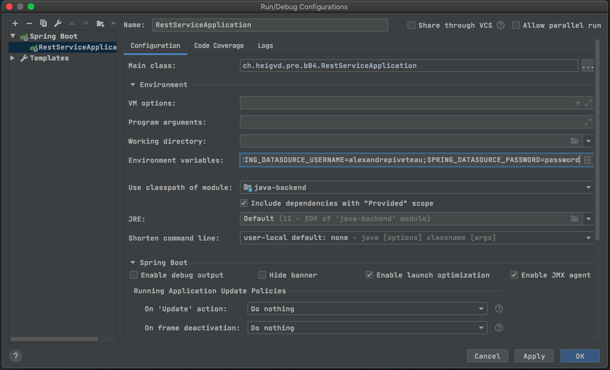
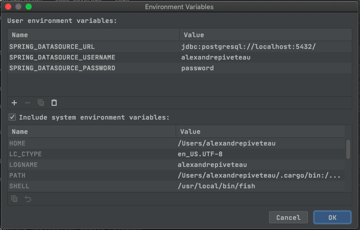

# Database set up

## How it works

### Continuous deployment

When code is pushed to the `master` branch, it is automatically deployed to Heroku. The database instance is attached to the application automatically, with the following on the environment variables :

+ `SPRING_DATASOURCE_URL` : The url of the **PostgreSQL** instance to connect to.
+ `SPRING_DATASOURCE_USERNAME` : The **username** to use when connecting to the database.
+ `SPRING_DATASOURCE_PASSWORD` : The **password** to use when connecting to the database.

On the continuous deployment pipeline, these variables are automatically provided by the Heroku instance, so it can connect to the Heroku-managed PostgreSQL instance.

### Local deployment

You probably want to deploy the app on your machine while developing ! To do this, you must :

1. Install PostgreSQL locally, and create a database with a username and a password.
2. Set up your environment variables to provide the 3 connection credentials for PostgreSQL.

If you use IntelliJ, you might want to create a **Spring Boot** launch configuration, and provide it with the connection information from your PostgreSQL. Your launch configuration will probably look like this :

And your environment variables for this launch configuration might look like this :

Remember to reference the right PostgreSQL port, as well as add a `/` at the end of the database path !